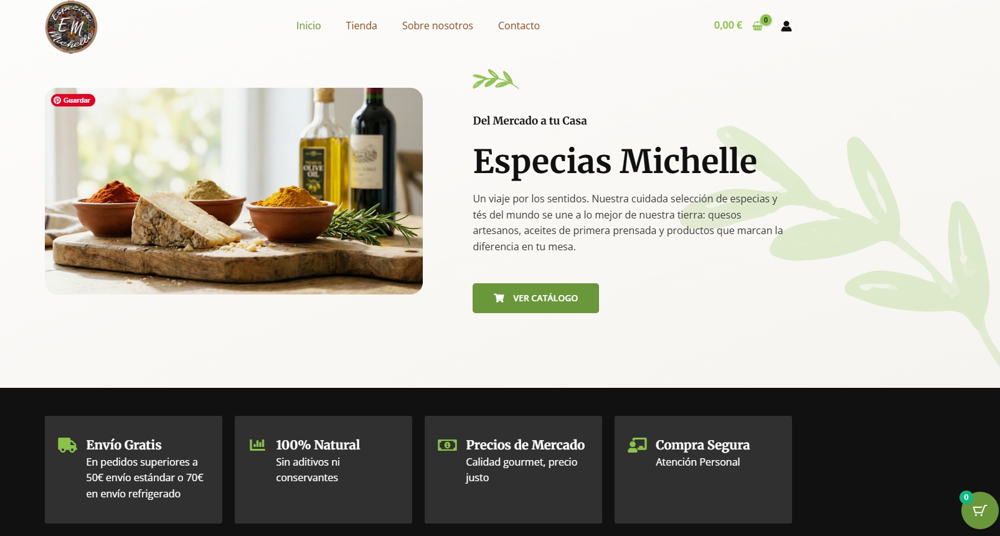
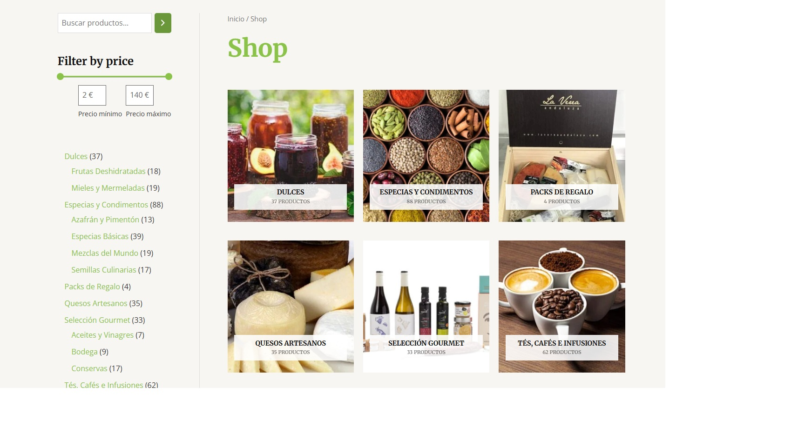
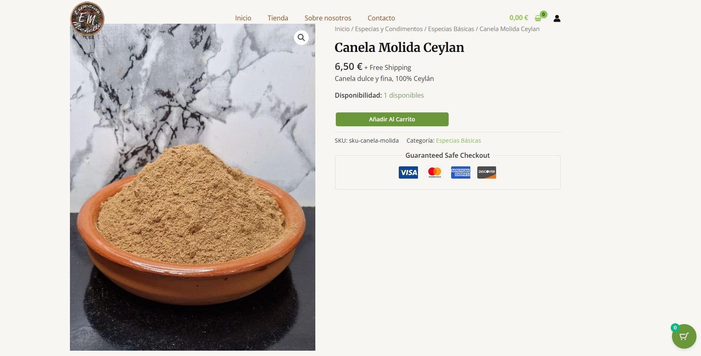
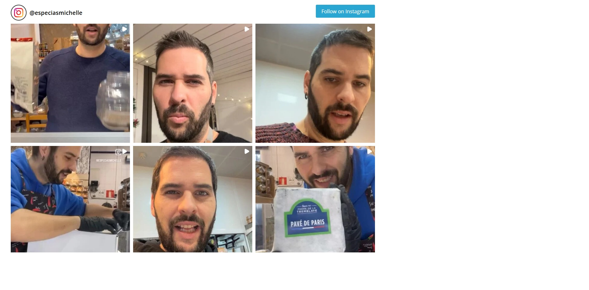
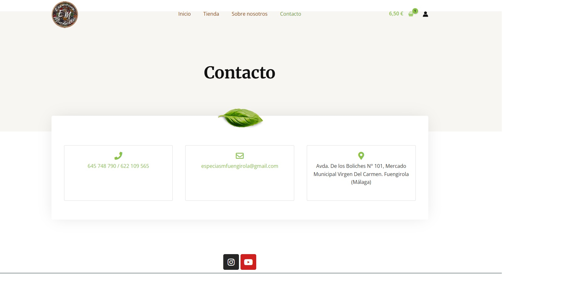

# Especias Michelle - E-commerce & Logística Compleja

Este proyecto consiste en el desarrollo, configuración y despliegue de una tienda online completa para un negocio local de especias y quesos artesanales. 

El desafío principal no fue solo el diseño, sino la implementación de una **lógica de envíos híbrida** (productos secos vs. refrigerados) para optimizar costes logísticos y mejorar la experiencia de usuario.

🔗 **Demo en vivo:** [https://especiasmichelle.com](https://especiasmichelle.com)

## 🛠 Tech Stack

* **CMS:** WordPress 6.x
* **E-commerce:** WooCommerce
* **Diseño UI/UX:** Elementor (Diseño Responsive)
* **SEO:** Rank Math
* **Servidor:** Hostinger (LiteSpeed Cache)
* **Control de Versiones:** Git / GitHub

## 🚀 Funcionalidades Clave & Desafíos Resueltos

### 1. Lógica de Envíos Condicional (Shipping Logic)
El mayor reto técnico fue gestionar dos tipos de productos con necesidades de transporte opuestas:
* **Problema:** Al mezclar productos secos (envío económico) con quesos (envío frío/caro), WooCommerce sumaba ambos costes, duplicando el precio para el cliente.
* **Solución:** Implementación de **Clases de Envío** y reglas de prioridad.
    * Si el carrito tiene solo secos → Tarifa A (5,90€).
    * Si el carrito tiene solo frío → Tarifa B (7,90€).
    * **Si el carrito es mixto** → El sistema detecta la clase superior ("Frío"), cobra solo esa tarifa y anula la del seco.
    * **Envío Gratuito:** Regla de anulación automática al superar los 60€.

### 2. Gestión de Productos Variables
Configuración avanzada de inventario para productos que se venden por peso:
* Creación de atributos globales y variaciones (250g, 500g, 1kg).
* Gestión de stock independiente por variación (SKU diferenciados).

### 3. Optimización y SEO
* Estrategia de palabras clave implementada con Rank Math.
* Configuración de Open Graph para compartir en redes sociales (WhatsApp/LinkedIn).
* Optimización de imágenes para tiempos de carga rápidos.

## 📸 Galería del Proyecto

### Portada y Diseño Visual
Diseño limpio orientado a la conversión y a resaltar la calidad del producto artesanal.

### Catálogo y Categorización
Estructura clara separando especias y productos refrigerados.

### Ficha de Producto Variable
Detalle de la configuración de selectores de peso y stock en tiempo real.

### Lógica del Carrito
Ejemplo del cálculo de envío funcionando correctamente.

### Integración Social
Sección de contacto y feed de Instagram para prueba social.

---

## 👨‍💻 Instalación y Despliegue

El proyecto fue desarrollado inicialmente en entorno local y migrado a producción utilizando **All-in-One WP Migration**.

1.  Configuración de entorno LAMP/XAMPP local.
2.  Desarrollo y pruebas de estrés de la lógica de envíos.
3.  Despliegue en servidor compartido y configuración de DNS.
4.  Configuración de seguridad (SSL) y correos transaccionales.

---
*Proyecto desarrollado por [Daniel Loreto](https://github.com/DanielML84)*
